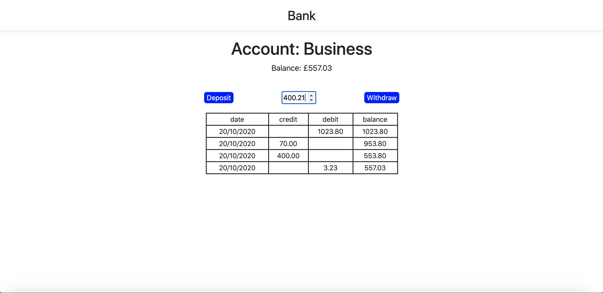

# Bank
C# .Net MVC project mocking a bank account interactions

A project designed to highlight my knowledge of C# & .Net framework, as well as code quality and process. [Source](https://github.com/makersacademy/course/blob/master/individual_challenges/bank_tech_test.md)

It allows you to create & delete accounts, deposit, withdraw, and see statements.

## To run

1. Clone this repo.

2. Install dependencies with:

   ```shell
   dotnet restore 
   ```
   
   ```shell
   cd ./Bank/ClientApp
   npm install
   ```
3. Run tests with:

   ```shell
   dotnet test ./Bank_Tests
   ```
4. Run the Program:

   ```shell
   dotnet run
   ```

### Original Requirements

* You should be able to interact with your code via a REPL like IRB or the JavaScript console.  (You don't need to implement a command line interface that takes input from STDIN.)
* Deposits, withdrawal.
* Account statement (date, amount, balance) printing.
* Data can be kept in memory (it doesn't need to be stored to a database or anything).

### Acceptance criteria

**Given** a client makes a deposit of 1000 on 10-01-2012  
**And** a deposit of 2000 on 13-01-2012  
**And** a withdrawal of 500 on 14-01-2012  
**When** she prints her bank statement  
**Then** she would see

```
date || credit || debit || balance
14/01/2012 || || 500.00 || 2500.00
13/01/2012 || 2000.00 || || 3000.00
10/01/2012 || 1000.00 || || 1000.00
```
## Example Screenshots



